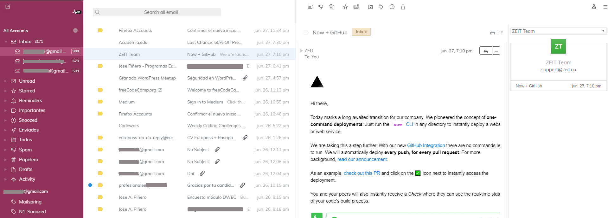

# minimalist theme for Mailspring

clean, simple, Polymail-inspired theme for Mailspring.

## Installing

1. [Download](https://getmailspring.com/) Mailspring - (desktop email client) if you have not yet
2. [Just download the master branch](https://github.com/jEstevezRod/mailspring-theme-less)
3. Open `Mailspring` -> `Install new theme...`

